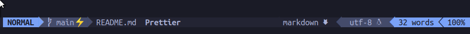
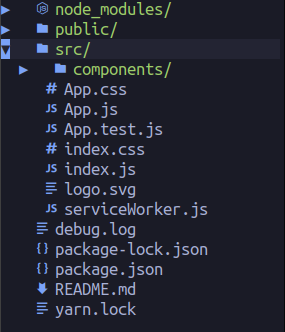

# nvim-config [DEPRECATED]

UPDATE: 

There are now native alternatives available that achieve the same or even better configuration using Lua. You can stay up to date through this repository: [https://github.com/VonHeikemen/lsp-zero.nvim](https://github.com/VonHeikemen/lsp-zero.nvim). For that reason, I've put together an [updated configuration](https://github.com/jayds19/native-nvim-lsp-setup) you can use as a reference. I hope you find it useful.

---

My personal nvim configuration for Node JS, React JS, TS development and more.

If you're on Linux or MacOS put the `init.vim` file in `~./config/nvim`, create that folder if it doesn't exists. This setup has a dependency on the Vundle plugin manager, so you should follow its [installation guide](https://github.com/VundleVim/Vundle.vim) beforehand.

To display the airline bar more stylized and nerdtree icons types, install [Nerd Fonts](https://www.nerdfonts.com/) and set in your Terminal configuration.

To avoid color-scheme display error on MacOS use [Iterm2](https://iterm2.com) instead Terminal

